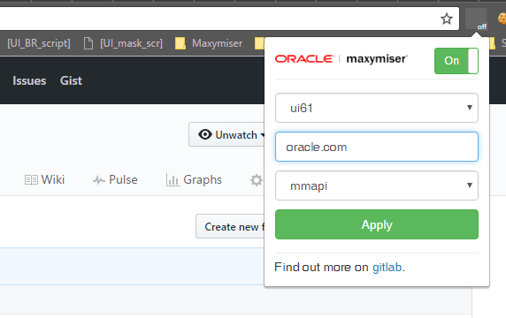

# Table Of Contents

+ [Overview](#Overview)

+ [Limitations](#limitations)

+ [Install](#install)

+ [TODO](#todo)

+ [How To Contribute?](#how-to-contribute)

# Overview

Current version: v1.5.20170320 // ressurrected

Goggle Chrome Extenstion for injecting `mmcore` / `mmapi` to any page.

# Limitations

+ Injecting is performed __async__. But don't worry, you won't see flicker! Document is being hidden before injecting Maxymiser library and then shown in response from Content Generator ;)

# Install

+ Clone or download the repo

+ Go to [chrome://extensions/](chrome://extensions/)

+ Tick "Developer mode" checkbox

+ Click "Load unpacked extension..."

+ Find and select "mm-inject" folder

# TODO

+ Update `mmapi` considering [hotfix](http://service.maxymiser.net/platform/eu/api/template/mmapi.js)

+ Host `mmcore` / `mmapi` templates on CDN

+ Write simple tests

# How To Contribute?

Please raise an issue [here](https://github.com/iL1nk/mm-inject-master/issues) or:

+ Fork the repo

+ Clone the repo from your fork

+ Write code

+ Test

+ Make Pull Request
